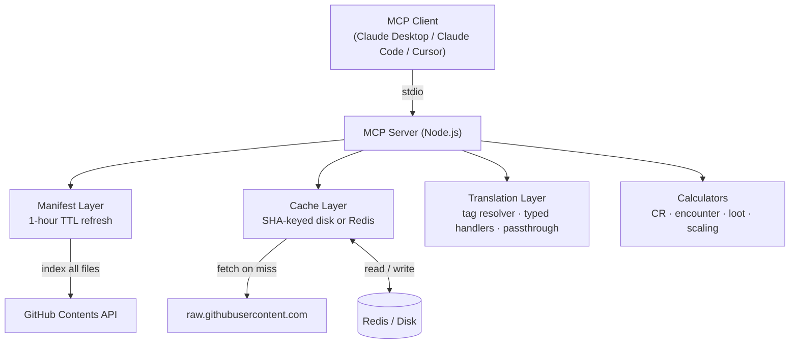

<h1><picture><source media="(prefers-color-scheme: dark)" srcset="assets/icon-dark.png"><source media="(prefers-color-scheme: light)" srcset="assets/icon-light.png"></picture> 5eMCP</h1>

[](https://github.com/jazzsequence/5eMCP/actions/workflows/test.yml)
[](https://github.com/jazzsequence/5eMCP/releases/latest)
[](https://github.com/jazzsequence/5eMCP/releases/latest)

A complete D&D 5e reference and utility MCP server backed by live [5etools](https://5e.tools) data.

## Quick Start

### Claude Desktop — One-Click Install (recommended)

No Node.js or terminal required.

1. Download `5eMCP.mcpb` from the [latest release](https://github.com/jazzsequence/5eMCP/releases/latest)
2. Open the file — Claude Desktop will prompt you to install it, **or** go to **Settings → Extensions → Install Extension** and select the file
3. Optionally enter a GitHub personal access token when prompted (recommended — unauthenticated requests are rate-limited to 60/hr)
4. Choose your default ruleset (`2024` or `2014`)
5. Restart Claude Desktop

Your token is stored securely in the OS keychain (macOS Keychain / Windows Credential Manager) — never in plain text.

---

### Developers (Claude Code, Cursor, manual config)

**Requirements:** Node.js ≥ 24, optional GitHub personal access token (read-only, public repos)

```bash
git clone https://github.com/jazzsequence/5eMCP.git
cd 5eMCP
npm install
npm run build
```

#### Claude Code

Add to `~/.claude.json`:

```json
{
  "mcpServers": {
    "5etools": {
      "command": "node",
      "args": ["/path/to/5eMCP/dist/index.js"],
      "env": {
        "GITHUB_TOKEN": "ghp_your_token_here",
        "DEFAULT_RULESET": "2024"
      }
    }
  }
}
```

#### Cursor

Add to `.cursor/mcp.json` in your project (or `~/.cursor/mcp.json` globally):

```json
{
  "mcpServers": {
    "5etools": {
      "command": "node",
      "args": ["/path/to/5eMCP/dist/index.js"],
      "env": {
        "GITHUB_TOKEN": "ghp_your_token_here",
        "DEFAULT_RULESET": "2024"
      }
    }
  }
}
```

#### Claude Desktop (manual config)

Add to `~/Library/Application Support/Claude/claude_desktop_config.json` (macOS) or `%APPDATA%\Claude\claude_desktop_config.json` (Windows):

```json
{
  "mcpServers": {
    "5etools": {
      "command": "node",
      "args": ["/path/to/5eMCP/dist/index.js"],
      "env": {
        "GITHUB_TOKEN": "ghp_your_token_here",
        "DEFAULT_RULESET": "2024"
      }
    }
  }
}
```

Replace `/path/to/5eMCP` with the absolute path to your clone. `DEFAULT_RULESET` can be `"2024"` (default) or `"2014"` for legacy rules. `GITHUB_TOKEN` is optional but strongly recommended — unauthenticated requests are rate-limited to 60/hr.

## How It Works

5e.tools is fully client-side. When `spells.html` loads, the browser fetches `data/spells/spells-phb.json` directly from GitHub and renders it in JavaScript. This server replicates that pattern server-side:

```
GitHub Contents API
  → manifest: { spells: [...], bestiary: [...], book: [...], ... }
  → SHA-keyed disk/Redis cache
  → raw.githubusercontent.com (fetch on miss)
  → translation layer (resolve {@tags}, merge fluff, normalize)
  → MCP tool response
```

The manifest is schema-agnostic and self-updating. When 5etools adds a new content type, the next manifest refresh picks it up automatically — no code change required. Unknown types run through the passthrough handler (tags resolved, internal fields stripped) and return clean JSON. Nothing is ever inaccessible.

## Available Tools

### Meta Tools
| Tool | Description |
|---|---|
| `manifest_status` | Build time, file counts by type, unknown types discovered. |
| `list_sources` | All source abbreviations with content types. |
| `fetch_content` | Fetch and translate any file in the manifest by content type + file name. Universal fallback for any content type. |

### Search Tools (`*_search`)
All search tools accept `query` (name substring), `ruleset` (`"2024"` or `"2014"`), `limit`, `fields` (optional list of field names to include in each result — default is all fields, e.g. `["name","cr","source"]`), and `include_homebrew` (boolean, default false — when true also searches TheGiddyLimit/homebrew alongside official results). Results match on name, source abbreviation, pantheon/setting, and any top-level array-of-strings field in the data (e.g. `damageInflict`, `conditionInflict`, `environment`, `property` tags like `"Vst|EGW"`).

Selected tools support additional structured filter parameters:

| Tool | Extra Parameters |
|---|---|
| `spell_search` | `level` (int 0–9), `school` (full name: evocation, necromancy, etc.) |
| `monster_search` | `type` (beast, humanoid, undead…), `cr_max` (max CR inclusive: "1/4", "1/2", "5"…), `environment` (habitat substring: "underdark", "forest", "nine hells"…) |
| `item_search` | `rarity` (common, uncommon, rare, very rare, legendary, artifact), `type` (weapon, armor, wondrous…) |

| Tool | Content |
|---|---|
| `spell_search` | Spells |
| `monster_search` | Monsters and creatures |
| `item_search` | Magic and mundane items |
| `race_search` | Playable species / races |
| `background_search` | Character backgrounds |
| `feat_search` | Feats |
| `condition_search` | Conditions and diseases |
| `vehicle_search` | Vehicles and vessels |
| `object_search` | Objects |
| `trap_search` | Traps and hazards |
| `psionic_search` | Psionic powers and disciplines |
| `deck_search` | Decks (e.g. Deck of Many Things) |
| `reward_search` | Supernatural gifts and boons |
| `optfeature_search` | Optional class features and invocations |
| `table_search` | Random tables |
| `variantrule_search` | Variant rules |
| `deity_search` | Deities and gods (searchable by pantheon/setting) |
| `language_search` | Languages |
| `skill_search` | Skills |
| `sense_search` | Senses (darkvision, tremorsense, etc.) |
| `book_search` | Sourcebooks (name, ID, source, publication date) |
| `adventure_search` | Published adventures |
| `class_search` | Character classes (official + homebrew) |
| `subclass_search` | Subclasses and archetypes |

### Get Tools (`*_get`)
Exact lookup by name with full fluff/description merged in. Accept `name`, optional `source`, and `ruleset`.

| Tool | Content |
|---|---|
| `spell_get` | Full spell entry with description |
| `monster_get` | Full stat block with lore |
| `item_get` | Full item entry with description |
| `race_get` | Full race entry with traits and fluff |
| `background_get` | Full background entry with fluff |
| `feat_get` | Full feat entry |
| `book_get` | Sourcebook metadata by name |
| `adventure_get` | Adventure metadata by name |
| `class_get` | Full class entry by name |
| `subclass_get` | Full subclass entry by name |

### Sourcebook & Adventure Content
| Tool | Description |
|---|---|
| `book_content_get` | Retrieve full prose from a sourcebook or adventure by source abbreviation (e.g. `SCC`, `EGW`, `SCC-CK`). Without `section`: returns a table of contents. With `section`: returns that section's text rendered as clean markdown. Supports deep nested section search (case-insensitive substring match). |

### Omnisearch
| Tool | Description |
|---|---|
| `omnisearch` | Search all 24 content types at once. Returns results tagged with `entityType`. Accepts `include_homebrew` (default **true** — homebrew is included by default). |

DM calculators (CR calculator, encounter builder, loot generator, CR scaling) are added in Phase 4.

## Environment Variables

| Variable | Default | Description |
|---|---|---|
| `GITHUB_TOKEN` | — | Read-only GitHub PAT. Strongly recommended. |
| `DEFAULT_RULESET` | `"2024"` | Which ruleset to use (`"2024"` or `"2014"`). |
| `MANIFEST_TTL_SECONDS` | `3600` | How often to rebuild the manifest (seconds). |
| `CACHE_DIR` | `~/.cache/5eMCP` | Disk cache location (local stdio mode). |
| `REDIS_URL` | — | Redis connection URL (e.g. `redis://localhost:6379`). When set and reachable, Redis is used instead of disk cache. Falls back to disk on connection failure. |

## Ruleset Support

All tools accept `ruleset: "2024" | "2014"`:

- `"2024"` → `5etools-mirror-3/5etools-src` (current rules)
- `"2014"` → `5etools-mirror-3/5etools-2014-src` (legacy rules)

## Development

```bash
npm run dev          # Run without compile step (tsx)
npm run build        # Compile TypeScript
npm run typecheck    # Type-check without emitting
npm test             # Run tests (Vitest)
npm run lint         # ESLint
```

This project uses TDD. Tests are written before implementation. See `AGENTS.md` for the full workflow including mandatory reviewer agent approval before commits.

```bash
# First-time setup: install git hooks
./.githooks/install.sh
```

## Architecture



## Legal

5etools data is fetched live from public GitHub repositories. This server does not store or redistribute any content. The GitHub API rate limit applies. A GitHub token is required for sustained use.

Calculator logic is ported from 5etools' MIT-licensed JavaScript source.

## Credits

D20 icon by [Delapouite](https://delapouite.com) via [game-icons.net](https://game-icons.net), licensed [CC BY 3.0](https://creativecommons.org/licenses/by/3.0/).
